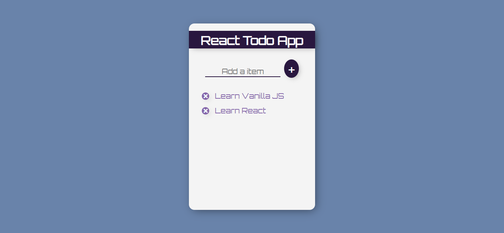

# React Todo application.

## How To install or use
1. Clone This Project `git clone https://github.com/jhhemal/todo.git`
2. Go to Project Directory `cd todo`
3. Finally run `npm start`

## Simple Demo
